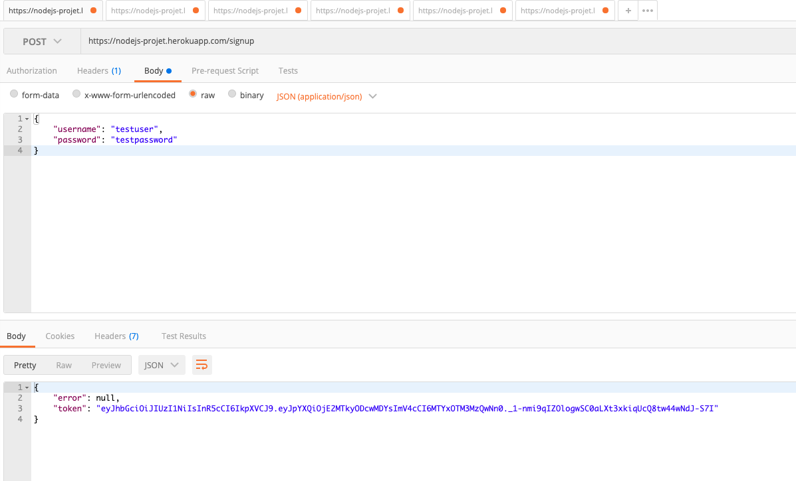
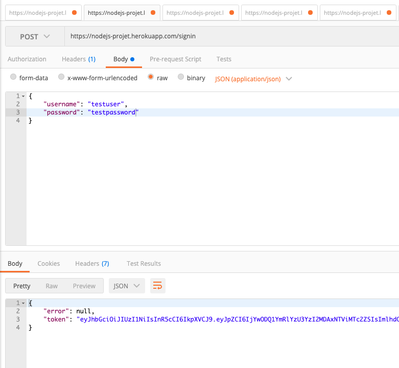

# api-node-projet
Projet Node ESGI

For local test use http://0.0.0.0:3000

# signup

# signin

curl -X POST --header "Content-Type: application/json" --data "{\"username\":\"ludovic\"}" "http://0.0.0.0:3000/login"
# access notes
curl -X GET --header "Content-Type: application/json" "http://localhost:3000/notes"

