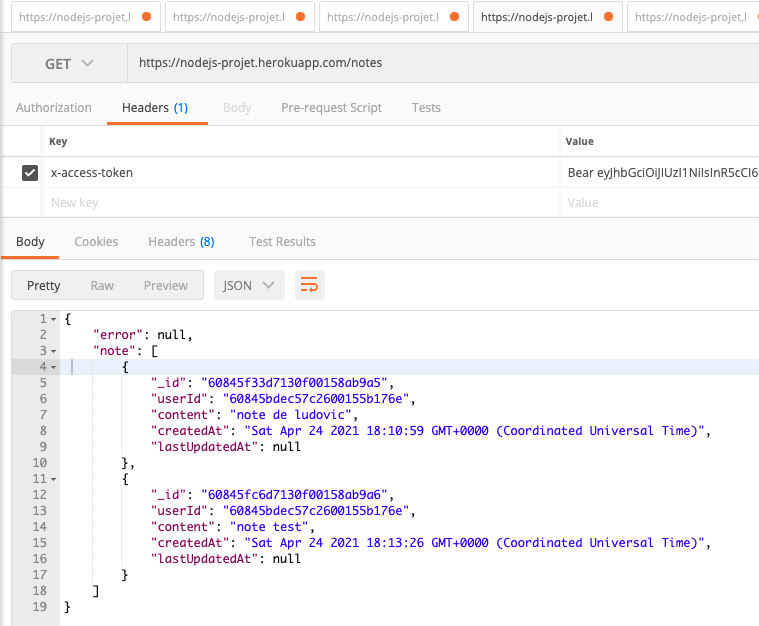
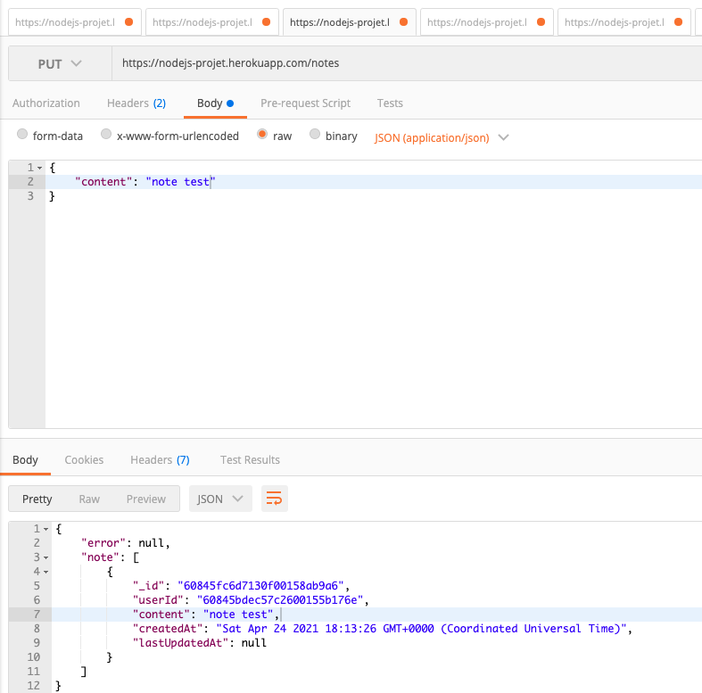
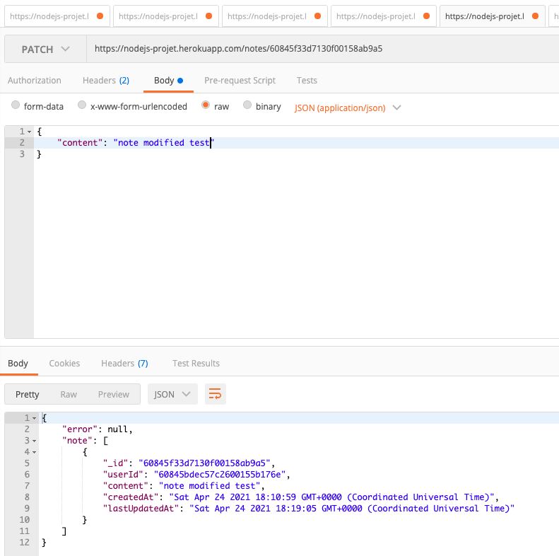
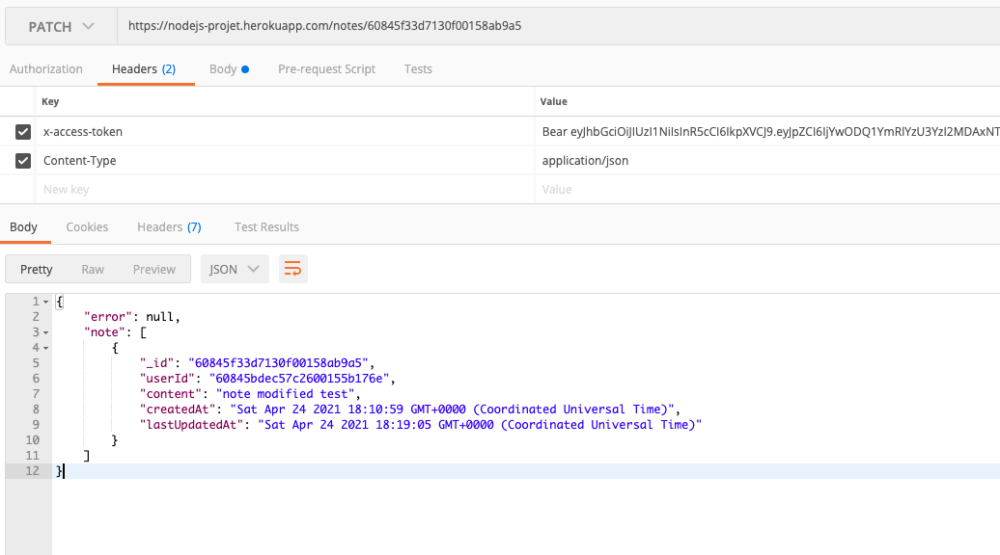
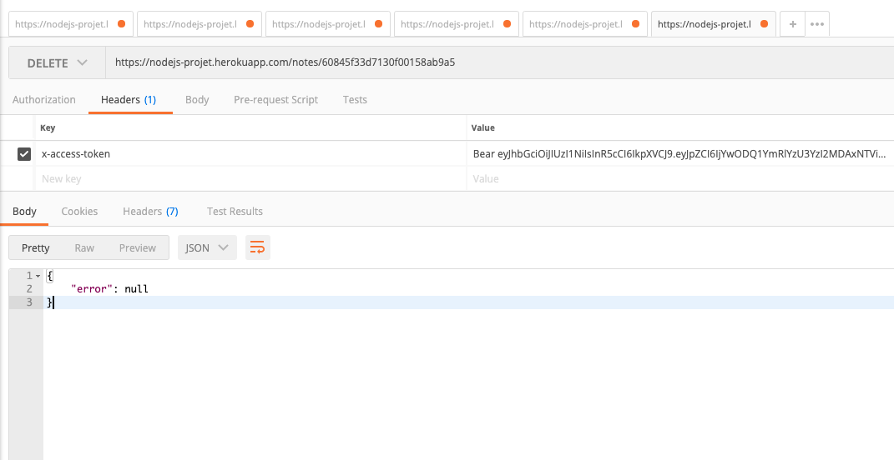

# api-node-projet
Projet Node ESGI

# Prerequisites

- Git 2.24 or <
- NPM 6.14.4 or <

# How to install
- First clone the repository at : https://github.com/tnicolas28/api-node-projet
- Open the cloned repository in your favorite IDE
- Open the terminal
- In your terminal write : npm install, it will install every node packages required
- To start the server, still in the terminal write : npm start

Congratulations, your server is started ! 

# How to use
- Setup a MongoDB database (Cloud or local)
- Keep the login URI to connect to your database

## In command line interface with CURL !

The route used here is the one we host on heroku, if you want to use it locally use this url "http://0.0.0.0:3000/" instead of "http://nodejs-projet.herokuapp.com/" !
Also if you do local tests before every command you'll have to write : MONGOURI = your_uri curl -X POST --header "Content-Type: application/json" --data "{\"username\":\"yourusername\",\"password\":\"password\"}" "http://nodejs-projet.herokuapp.com/signup

## Create an account 
curl -X POST --header "Content-Type: application/json" --data "{\"username\":\"yourusername\",\"password\":\"password\"}" "http://nodejs-projet.herokuapp.com/signup"

## Then Sign In with your freshly created account !
curl -X POST --header "Content-Type: application/json" --data "{\"username\":\"yourusername\",\"password\":\"password\"}"  "http://nodejs-projet.herokuapp.com/signin"

The API will return a token that you'll have to save ! You'll have to insert it in every request you'll make to retrieve datas

## To insert a grade 
Remember the token returned when you signed in, we'll use it here ! Replace 'yourtoken' by the token you saved :) !

curl -X POST --header "Content-Type: application/json" --header "x-access-token:bear yourtoken" --data "{\"content\":\"your_content\"} "http//nodejs-projet.herokuapp.com/notes

## To patch a grade
curl -X PATCH --header "Content-Type: application/json" --header "x-access-token:bear yourtoken" "http//nodejs-projet.herokuapp.com/notes/{id_of_the_grade}

## To display every grades
curl -X GET --header "Content-Type: application/json" --header "x-access-token:bear yourtoken" "http//nodejs-projet.herokuapp.com/notes

## To delete a specific grade
curl -X DELETE --header "Content-Type: application/json" --header "x-access-token:bear yourtoken" "http//nodejs-projet.herokuapp.com/notes/{id_of_the_grade}

## WITH Postman

## signup

## signin

## get 

## put 

## patch
- Request Body:

- Request Headers:

## delete

